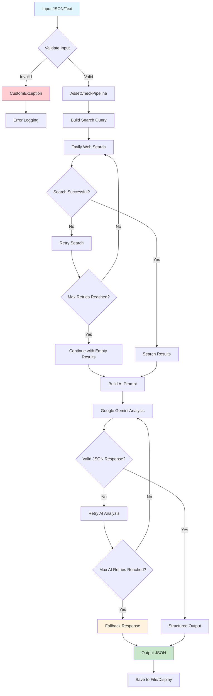

# Classify Gen

A powerful AI-driven asset classification system that automatically identifies and categorizes various assets (laptops, mobile devices, cameras, televisions, etc.) using advanced web search and Google Gemini AI analysis.

## System Architecture

The Classify Gen system follows a modular pipeline architecture that processes asset information through multiple stages to deliver accurate classification results.

### Workflow Diagram



### Detailed Workflow Explanation:

1. **Input Processing**: The system accepts asset information including model number, asset classification name, manufacturer, and optional GUID
2. **Input Validation**: Validates required fields and data format, throwing CustomException for invalid inputs
3. **Query Construction**: Builds search query combining model number, manufacturer, and classification information
4. **Web Search Phase**: 
   - Tavily API searches for relevant asset information across the web
   - Implements retry logic (up to 2 attempts) for failed searches
   - Continues with empty results if all search attempts fail
5. **AI Analysis Phase**:
   - Constructs detailed prompt with search results and input data
   - Google Gemini AI processes the information to generate structured classification
   - Validates JSON response completeness and format
   - Implements retry logic (up to 5 attempts) for invalid responses
6. **Output Generation**: Returns standardized JSON with asset classification, manufacturer, model number, product line, and summary
7. **Fallback Mechanism**: Provides default classification response if all AI attempts fail
8. **Logging & Monitoring**: Comprehensive logging throughout the pipeline for debugging and monitoring

## Setup and Installation

### Prerequisites
- Python 3.8 or higher
- API keys for Tavily and Google Gemini

### Installation Steps

1. **Clone the repository**:
   ```bash
   git clone <repository-url>
   cd "Classify Gen"
   ```

2. **Create virtual environment**:
   ```bash
   python -m venv venv
   venv\Scripts\activate  # Windows
   # source venv/bin/activate  # Linux/Mac
   ```

3. **Install dependencies**:
   ```bash
   pip install -r requirements.txt
   ```

4. **Create logs directory**:
   ```bash
   mkdir logs
   ```

## Configuration

### Environment Variables

Create a `.env` file in the project root with the following variables:

```env
GEMINI_API_KEY=your_google_gemini_api_key_here
TAVILY_API_KEY=your_tavily_api_key_here
```

### API Key Setup

1. **Google Gemini API Key**:
   - Visit [Google AI Studio](https://makersuite.google.com/app/apikey)
   - Create a new API key
   - Add it to your `.env` file

2. **Tavily API Key**:
   - Sign up at [Tavily](https://tavily.com/)
   - Generate an API key from your dashboard
   - Add it to your `.env` file

### Configuration Parameters

The system includes configurable parameters in `config/config.py`:
- `MAX_SEARCH_RETRIES`: Number of search retry attempts (default: 2)
- `MAX_LLM_RETRIES`: Number of AI analysis retry attempts (default: 5)

## Usage Examples

### Command Line Interface

1. **Prepare input data** in `input.json`:
   ```json
   [
     {
       "model_number": "XPS 13 9310",
       "asset_classification_name": "Laptop",
       "manufacturer": "Dell",
       "asset_classification_guid2": ""
     }
   ]
   ```

2. **Run the classification**:
   ```bash
   python main.py
   ```

3. **Check results** in `output.json`:
   ```json
   [
     {
       "asset_classification": "Laptop",
       "manufacturer": "Dell",
       "model_number": "XPS 13 9310",
       "product_line": "XPS",
       "summary": "Dell XPS 13 9310 is a premium ultrabook laptop..."
     }
   ]
   ```

### Python API Usage

```python
from pipeline.pipeline import AssetCheckPipeline
from config.config import Config

# Initialize pipeline
pipeline = AssetCheckPipeline(
    tavily_api_key=Config.TAVILY_API_KEY,
    gemini_api_key=Config.GEMINI_API_KEY
)

# Classify single asset
result = pipeline.run(
    model_number="iPhone 14 Pro",
    asset_classification_name="Mobile",
    manufacturer="Apple"
)

print(result)
```

## Future Improvements

- **Advanced ML Models**: Integrate additional machine learning models for improved accuracy
- **Image Recognition**: Add capability to classify assets from images
- **Bulk Import**: Support for CSV and Excel file imports
- **Real-time Processing**: Implement real-time asset classification streaming
- **Multi-language Support**: Add support for asset information in multiple languages
---

**Note**: This project requires valid API keys for Tavily and Google Gemini services. Please ensure you have proper API access and follow the respective terms of service for these platforms.
